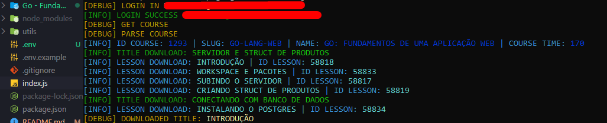

# Alura Video Downloader

Você deseja ter a flexibilidade de assistir aos seus cursos da Alura em qualquer lugar, mesmo sem conexão à internet? Com o Alura Video Downloader, você pode baixar todas as aulas dos seus cursos e desfrutar do conteúdo offline.

 

## Funcionalidades

- Multiplos donwnloads
- Arquivos baixados organizados em pastas

 

## Instalação e Execução

Clonando o repositório do projeto:

    $ git clone https://github.com/SirSavio/alura-downloader.git

Preencha seu usuário e senha do portal da Alura, nas linhas 11 e 12 do arquivo **config.json**:

    "email": "EMAIL",
    "password": "PASSWORD",

Instale as dependências do projeto:

    $ npm install

Inicie a aplicação:

    $ node index.js

    

   
## Preview

 

## Contribuições e Melhorias

- Reportar bugs
- Sugestões de funcionalidades
- Corrija algo e abra uma pull request

 

## Considerações

Os desenvolvedores não assumem nenhuma responsabilidade e não são responsáveis ​​por qualquer uso indevido. O Alura Video Downloader é apenas uma ferramenta de facilitação para alunos baixarem os cursos adquiridos na plataforma, permitindo que consigam dar sequência aos seus estudos, ainda que não tenham uma conexão de internet disponível.

 

## Desenvolvedores

* [@reinaldomoreira](https://github.com/reinaldomoreira)
* [@v4p0r](https://github.com/v4p0r)
* [@SirSavio](https://github.com/sirsavio)